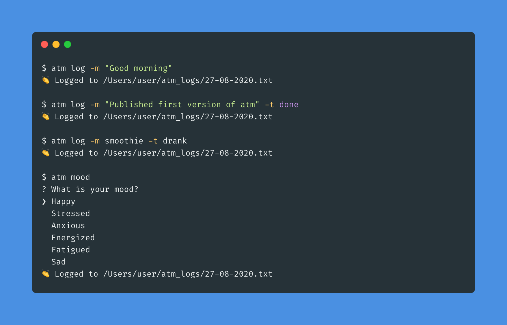
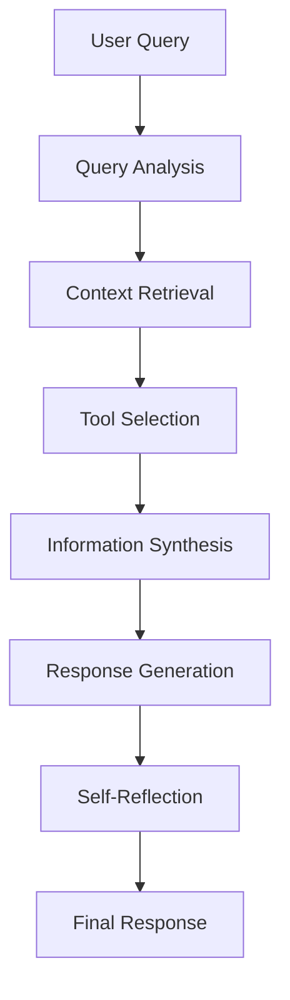

# uos – uOS.

### A personal logging and tracking CLI with AI assistance.

A comprehensive command-line interface for logging your daily activities, tracking tasks, and getting AI-powered assistance.



## Inspiration

* [UdaraJay/atm](https://github.com/UdaraJay/atm]: commandline logging.
* UdaraJay/uOS: My personal AI and home operating system

## How it works

**uos** is a powerful CLI tool that combines personal logging with AI assistance. It writes logs into a `uos_log` folder in your user directory, with one log file per day (`dd-mm-yyyy.txt`). All data is stored locally, and you can back them up and use them however you like.

## Installation

```sh-session
$ npm install -g @midasxiv/uos
```

## Local installation

1. **Clone the Repository:**
   - Clone the repository of your Node.js application to your local machine using Git:
     ```bash
     git clone https://github.com/MidasXIV/uOS.git
     cd uOS
     ```

2. **Install Dependencies:**
   - Navigate to the root directory of your application.
   - Run `npm install` to install the project dependencies.

3. **Link the Package Globally:**
   - While still in the root directory, run the following command to link your package globally:
     ```bash
     npm link
     ```
     This command will create a symbolic link from the global `node_modules` directory to your local development directory.

4. **Make Changes Locally:**
   - Make any changes or modifications to your code in your local development directory.

5. **Test Locally:**
   - Run and test your application locally by using commands like:
     ```bash
     yarn build
     bin\dev.cmd <command-name>
     ```

6. **Re-Link as Needed:**
   - If you make changes to the code and want to test them globally, re-run `npm link` in your local directory to update the global link.

Remember, if you are frequently making changes and testing locally, it's a good practice to unlink the package globally (`npm unlink`) when you are done with development and before publishing updates. This ensures that you are using the published version when installed globally.

## Available Commands

### Core Commands

#### `uos log`
Log general activities and thoughts.

```bash
# Basic logging
uos log -m "Good morning"

# Log with type
uos log -m "Published first version of uos" -t done

# Log with custom type
uos log -m smoothie -t drank
```

#### `uos mood`
Track your mood and emotional state.

```bash
uos mood
# Follow the interactive prompts to:
# - Name the feeling
# - Describe what caused it
# - Note resulting behaviors
# - Assess appropriateness
# - Plan improvements
```

#### `uos decision`
Maintain a decision journal.

```bash
uos decision
# Follow the interactive prompts to:
# - Record the decision
# - Note your mental/physical state
# - Describe the situation/context
# - Frame the problem
```

#### `uos review`
View and analyze your logs.

```bash
# Review today's logs
uos review

# Review weekly logs
uos review week

# Review monthly logs
uos review month

# Options
uos review --extended  # Show extra columns
uos review --csv      # Output in CSV format
uos review --filter   # Filter by property
```

### AI-Assisted Commands

#### `uos chat`
Interactive chat with Youno, your AI assistant.

```bash
# Start a chat session
uos chat

# Start with custom system prompt
uos chat --system "You are a coding assistant specialized in TypeScript."
```

Features:
- Interactive chat interface
- Customizable system prompts
- Token usage tracking
- Chat history logging
- Friendly and personable responses

#### `uos gemini`
Analyze screenshots and monitor tasks using Gemini AI.

```bash
# Analyze a screenshot
uos gemini "Analyze my screen" --image "screenshot.png"
```

Analysis includes:
- Task status (On Task/Off Task/Unclear)
- Project and task identification
- Time spent estimation
- Work patterns and suggestions
- Potential distractions
- Unresolved issues

## Future Enhancements

### Self-Agentic RAG System

Youno is being enhanced to become a self-agentic Retrieval-Augmented Generation (RAG) system with the following capabilities:

#### 1. Dynamic Context Retrieval
- **Work History Integration**: Implement vector embeddings of user's daily logs, project files, and work history
- **Semantic Search**: Utilize FAISS or similar vector databases for efficient similarity search
- **Context Window Management**: Implement sliding window approach for relevant context selection

#### 2. Tool Integration
- **Web Search Capabilities**: Integrate with search APIs for real-time information retrieval
- **Code Analysis Tools**: Implement AST parsing and code understanding capabilities
- **Project Context Tools**: Access to project structure, dependencies, and documentation

#### 3. Agent Architecture
- **Self-Reflection Loop**: Implement a feedback mechanism for response quality assessment
- **Tool Selection Logic**: Dynamic tool selection based on query analysis and context
- **Multi-Step Reasoning**: Chain-of-thought prompting for complex problem-solving

#### 4. RAG Pipeline


#### 5. Technical Implementation
- **Vector Store**: Implement using FAISS or Pinecone for efficient similarity search
- **Embedding Model**: Utilize state-of-the-art embedding models for context representation
- **Tool Registry**: Create a modular system for tool registration and execution
- **Memory Management**: Implement efficient context window management and caching

#### 6. Performance Metrics
- **Relevance Score**: Measure context retrieval accuracy
- **Tool Utilization**: Track effectiveness of different tools
- **Response Quality**: Implement automated quality assessment
- **Latency Optimization**: Monitor and optimize response times

This enhancement will transform Youno into a sophisticated AI assistant capable of:
- Proactively retrieving relevant context from user's work history
- Making informed decisions about tool usage
- Providing more accurate and contextually relevant responses
- Learning from interactions to improve future responses
