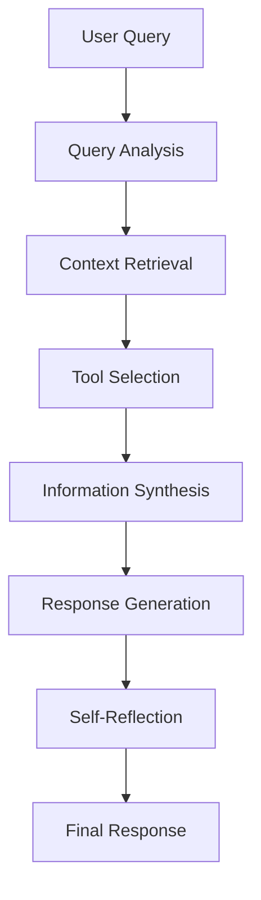

# Chat Command

The chat command provides an interactive chat interface with Youno, a friendly AI assistant powered by Google's Gemini model.

## Features

- Interactive chat session with Youno
- Customizable system prompts
- Token usage tracking
- Chat history logging
- Friendly and personable AI responses

## Usage

```bash
# Start a chat session with default system prompt
uos chat

# Start a chat session with a custom system prompt
uos chat --system "You are a coding assistant specialized in TypeScript."
```

## System Prompts

The chat command accepts a `--system` flag to customize Youno's behavior. If not specified, Youno uses a default friendly and helpful personality.

Example system prompts:
```bash
# General assistant
uos chat --system "You are a helpful AI assistant."

# Coding assistant
uos chat --system "You are a coding assistant specialized in TypeScript and Node.js."

# Writing assistant
uos chat --system "You are a writing assistant that helps with creative writing and editing."
```

## Chat Session

During a chat session:
- Type your messages and press Enter to send
- Type `exit` or `quit` to end the session
- All interactions are logged with timestamps
- Token usage is tracked and displayed at the end of the session

## Token Usage

The chat command tracks token usage for each interaction:
- Input tokens (your messages)
- Output tokens (Youno's responses)
- Total tokens used

Token usage summary is displayed when ending the session:
```
Token Usage Summary:
Today's Usage: 495 tokens
Total Usage: 495 tokens
Average Daily Usage: 495 tokens
```

## Logging

All chat interactions are logged to the daily log file with timestamps:
```
[14:30] Chat - User: Hello | AI: Hi there! How can I help you today? 😊
```

## Examples

1. Starting a general chat:
```bash
uos chat
```

2. Starting a coding-focused chat:
```bash
uos chat --system "You are a coding assistant that helps with debugging and code reviews."
```

3. Starting a writing-focused chat:
```bash
uos chat --system "You are a writing assistant that helps with creative writing and editing."
```

## Notes

- The chat session maintains context throughout the conversation
- All interactions are logged locally
- Token usage is tracked per day and in total
- The AI assistant (Youno) has a friendly and approachable personality by default

## Future Enhancements

### Self-Agentic RAG System

Youno is being enhanced to become a self-agentic Retrieval-Augmented Generation (RAG) system with the following capabilities:

#### 1. Dynamic Context Retrieval
- **Work History Integration**: Implement vector embeddings of user's daily logs, project files, and work history
- **Semantic Search**: Utilize FAISS or similar vector databases for efficient similarity search
- **Context Window Management**: Implement sliding window approach for relevant context selection

#### 2. Tool Integration
- **Web Search Capabilities**: Integrate with search APIs for real-time information retrieval
- **Code Analysis Tools**: Implement AST parsing and code understanding capabilities
- **Project Context Tools**: Access to project structure, dependencies, and documentation

#### 3. Agent Architecture
- **Self-Reflection Loop**: Implement a feedback mechanism for response quality assessment
- **Tool Selection Logic**: Dynamic tool selection based on query analysis and context
- **Multi-Step Reasoning**: Chain-of-thought prompting for complex problem-solving

#### 4. RAG Pipeline


#### 5. Technical Implementation
- **Vector Store**: Implement using FAISS or Pinecone for efficient similarity search
- **Embedding Model**: Utilize state-of-the-art embedding models for context representation
- **Tool Registry**: Create a modular system for tool registration and execution
- **Memory Management**: Implement efficient context window management and caching

#### 6. Performance Metrics
- **Relevance Score**: Measure context retrieval accuracy
- **Tool Utilization**: Track effectiveness of different tools
- **Response Quality**: Implement automated quality assessment
- **Latency Optimization**: Monitor and optimize response times

This enhancement will transform Youno into a sophisticated AI assistant capable of:
- Proactively retrieving relevant context from user's work history
- Making informed decisions about tool usage
- Providing more accurate and contextually relevant responses
- Learning from interactions to improve future responses 
